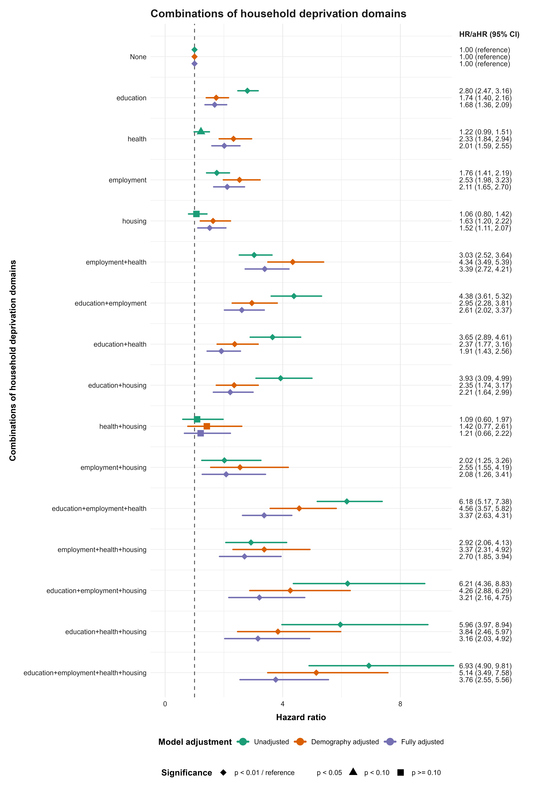

# Household Socioeconomic Circumstances and Age at First Registration on the Welsh Child Protection Register: A Survival Analysis Using Linked Administrative and Census Data

This repository documents a population-based survival analysis of household deprivation and the timing of first observed registration on the Welsh Child Protection Register (CPR). It separates code that must run inside the Secure Anonymised Information Linkage (SAIL) trusted research environment from public plotting code that uses only SAIL-cleared aggregate or model-derived exports.

## Extended abstract

**Background and objective.** Socioeconomic inequalities are consistently observed in statutory child-protection activity, yet much UK evidence concerns neighbourhood deprivation or later service-pathway events. Area measures can obscure household conditions, while counts conceal combinations of education, employment, health/disability, and housing disadvantage. This limits understanding of household circumstances across the intervention pathway. Child Protection Register (CPR) registration is an administrative response, not a direct measure of maltreatment onset. This study examined deprivation breadth and composition in relation to age at first observed CPR registration in Wales, adding household-level evidence, age-specific risk trajectories, and scenario-based population-impact estimates.

**Methods.** This population-based linked administrative-data cohort comprised 106,365 eligible live births in Wales from 1 January 2010 to 31 December 2012. Children were followed from birth until first observed CPR registration, death, or 31 May 2021. Records were linked through Child Wellbeing: The Cohort for Health within the Secure Anonymised Information Linkage Databank. Maternal 2011 Census household circumstances were represented by a count of four deprivation domains—education, employment, health and disability, and housing—and by their recorded combinations. Cox models used child age as the time scale and estimated hazard ratios across exposure-only, demography-adjusted, and fully adjusted stages. Risk curves, Schoenfeld-residual diagnostics, and directly standardized population attributable fractions supplemented the hazard ratios. Fully adjusted analyses included 89,177 complete cases. Analysis was conducted in R within the trusted research environment; only SAIL-cleared aggregate and model-derived outputs were exported.

**Results.** There were 2,158 first observed registrations (2.03%). Among 89,191 children with a deprivation count, 37,282 (41.80%) experienced at least one deprived domain. Relative to no recorded deprived domains, fully adjusted hazard ratios rose from 1.88 (95% confidence interval 1.60–2.22) for one domain to 2.60 (2.18–3.11), 3.42 (2.78–4.21), and 4.04 (2.75–5.94) for two, three, and four domains. The employment-plus-health profile had a fully adjusted hazard ratio of 3.39 (2.72–4.21), comparable to or greater than several three-domain profiles. Risk curves separated early and generally widened across childhood. Scenario analyses gave greater population impact to common one- and two-domain groups than to the rare four-domain group, illustrating that population impact depends on prevalence as well as relative association. Proportional-hazards tests indicated time variation in selected associations, so some hazard ratios are follow-up-weighted summaries rather than age-constant effects.

**Interpretation.** Findings support addressing material hardship in households alongside relationship-based family support and safeguarding. Because common one- and two-domain groups contributed more to some modelled population contrasts than the rare four-domain group, prevention should be accessible across the socioeconomic distribution and intensified as needs accumulate. Profiles can help practitioners coordinate children's services, primary care, welfare advice, disability/carer support, childcare, and housing, especially where employment and health needs coincide. They should inform support, not operate as predictive labels or surveillance triggers. The findings strengthen the case for evaluating resourced, equity-monitored assistance while distinguishing unmet material need from parental harm.

## Study overview

- **Design:** population-based linked administrative-data cohort.
- **Population:** 106,365 eligible live births in Wales during 2010–2012.
- **Follow-up:** birth to first observed CPR registration, death, or 31 May 2021.
- **Primary exposures:** maternal household deprivation count (zero to four domains) and the recorded combination of education, employment, health/disability, and housing deprivation.
- **Outcome:** first observed CPR registration for any recorded reason.
- **Analysis:** Cox proportional-hazards models with child age as the time scale; staged adjustment; risk curves; proportional-hazards diagnostics; and scenario-specific population attributable fractions (PAFs).

The outcome reflects recorded statutory activity, not the onset or prevalence of child maltreatment. The analyses are observational. Adjustment stages describe conditional associations and are not a causal decomposition.

Here, a PAF is the model-estimated relative change from observed CPR risk to risk under one stated counterfactual reassignment. For example, moving a specified deprivation-count category to a lower category while leaving other categories unchanged. A positive 5% estimate means the model predicts approximately 5% lower CPR registration risk under that scenario than under the observed exposure distribution; a negative estimate means higher predicted risk. These conditional scenario contrasts are not observed intervention effects or percentages of registrations proven preventable.

## Key outputs

### Hazard ratios by household-deprivation profile



Points show hazard ratios (HRs) or adjusted hazard ratios (aHRs); horizontal intervals show 95% confidence intervals.

### Registration-risk trajectories by deprivation count and profile


This is a public copy of the disclosure-controlled figure produced in SAIL. The curves were smoothed for disclosure control and include small tail perturbations applied to the display only. They are not competing-risk cumulative incidence estimates, and the adjusted panels are conditional model predictions rather than population-standardized risks.

## Secure-to-public workflow

| Stage | Location | What happens                                                                                                                   | Public reproducibility boundary |
|---|---|--------------------------------------------------------------------------------------------------------------------------------|---|
| Linked-data preparation and modelling | `sail_sdc/scripts/` | Cohort construction, Census linkage, variable derivation, Cox models, diagnostics, attributable fractions, and survival curves | Requires approved access to individual-level linked data in SAIL; cannot be reproduced from this repository alone |
| Disclosure-controlled outputs | `sail_sdc/outputs/` | SAIL-cleared aggregate tables, model summaries, diagnostic plots, formatted documents, and figures                             | All analytical files are public releases and available to Git; none contains row-level data |
| Public figure generation | `scripts/` | Released aggregate/model tables are converted into forest plots and attributable fraction figures                              | Reproducible outside SAIL with R and the repository inputs |
| Public deliverables | `outputs/` | PNG/PDF figures and auditable plotting datasets                                                                                | Directly displayable and reusable with the accompanying interpretation notes |

Individual-level data, linkage identifiers, dates, small-cell working tables, and R workspace images are not part of the public workflow.

## Repository structure (abridged)

```text
.
├── README.md
├── cpr_survival_analysis.Rproj
├── outputs/
│   ├── README.md
│   └── ... public figures and audit files
├── scripts/
│   ├── README.md
│   ├── forestplot_m_hh_deprv_dms.R
│   ├── forestplot_m_hh_deprv_no.R
│   └── plot_paf_from_sdc_tables.R
└── sail_sdc/
    ├── README.md
    ├── scripts/
    │   └── README.md
    └── outputs/
        ├── README.md
        └── ... SAIL-cleared tables, documents, and figures
```

See the folder READMEs for file-level inputs, outputs, and execution constraints. The integrated [output catalogue and variable dictionary](sail_sdc/outputs/README.md#variable-dictionary) documents released files, analysis variables, and exported table fields using only definitions supported by the code, manuscript, labels, or metadata.

## Reproducing public figures

From the repository root, run:

```text
Rscript scripts/plot_paf_from_sdc_tables.R
Rscript scripts/forestplot_m_hh_deprv_no.R
Rscript scripts/forestplot_m_hh_deprv_dms.R
```

The scripts locate the project root from their own file path. They can therefore be launched from another working directory when the command supplies an absolute or otherwise valid path to the script.

Required public packages are `tidyverse`, `readxl`, `patchwork`, and their dependencies. The plotting scripts were validated with R 4.5.1, tidyverse 2.0.0, readxl 1.4.5, ggplot2 3.5.2, patchwork 1.3.2, and scales 1.4.0. Package versions are not currently locked; consult the generated session-information files when exact rendering differences matter.

The public PAF script reads the two released workbooks at `sail_sdc/outputs/paf_dprv_count.xlsx` (sheets `dprv_no_2_non`, `dprv_rdtn_by1`, and `dprv_rdtn_by2`) and `sail_sdc/outputs/paf_dprv_dms.xlsx` (sheets `dprv_dms_2_non` and `dprv_dms_rmvl`). It does not require `graphPAF` or individual-level data. The forest scripts read the released bivariate and multivariable model tables in the same directory. Inputs are recorded in [sail_sdc/outputs/README.md](sail_sdc/outputs/README.md). See [scripts/README.md](scripts/README.md) for the complete file contract.

## Data access, disclosure control, and responsible use

Individual-level linked data are held in the SAIL Databank and are not publicly available. Access requires the relevant information governance and project approvals. This repository does not provide, and must not be used to reconstruct, person-level data.

Every analytical output currently present in `sail_sdc/outputs/` has completed SAIL disclosure control and is cleared for public use and publication. These files contain aggregate or model-derived material only and are available to Git.

The deprivation measures are analytical exposures, not individual prediction tools. They should not be used as deterministic labels or to intensify surveillance of families. Scenario-specific attributable fractions are conditional, model-based contrasts; they are not percentages of registrations guaranteed to be prevented by an intervention. The operational coding and its known source-data limitations are documented in the [variable dictionary](sail_sdc/outputs/README.md#household-deprivation-data-quality-limitation).

## Citation

This repository is journal-independent. Cite the associated manuscript and the specific GitHub release or commit used, including the repository title shown above.
