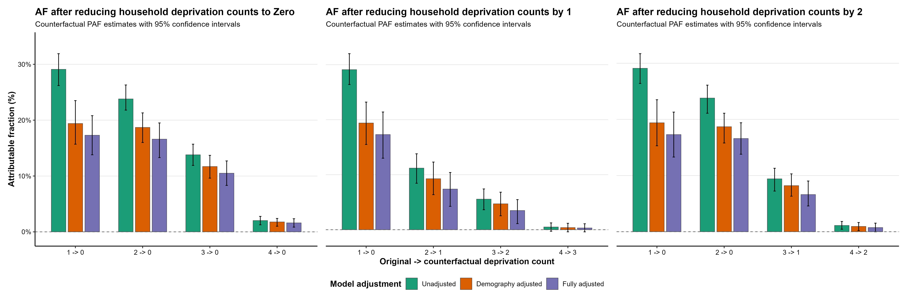
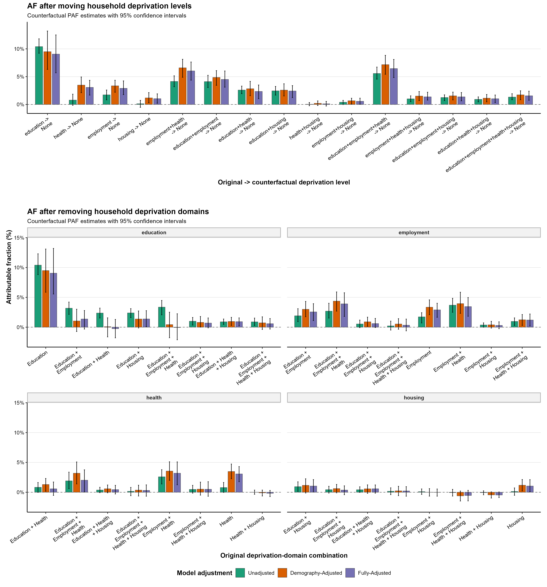

# Public outputs

## Key population attributable-fraction figures

### Household deprivation count

These plots present model-estimated population attributable fractions (PAFs) for counterfactual reductions in the number of deprived household domains (to zero or by one or two domains) across the study's adjustment stages.

### Household deprivation domains

These plots present model-estimated PAFs for counterfactual changes to household deprivation-domain profiles, including movement to no recorded deprivation and removal of a specified domain, across the study's adjustment stages.

This folder contains SAIL-cleared public figures and the plotting datasets needed to audit the forest plots. It contains no row-level linked data.

## Figures

| File | Description                                                                                      | Provenance |
|--|--------------------------------------------------------------------------------------------------|--|
| `forestplot_m_hh_deprv_no_adjustment_stack.png` / `.pdf` | Hazard ratios by number of deprived household domains across three model stages                  | Generated by `scripts/forestplot_m_hh_deprv_no.R` from the supplied model tables |
| `forestplot_m_hh_deprv_dms_adjustment_stack.png` / `.pdf` | Hazard ratios by exact deprivation-domain profile across three model stages                      | Generated by `scripts/forestplot_m_hh_deprv_dms.R` from the supplied model tables |
| `paf_pdrv_no_all_stch_plts.png` / `.pdf` | Scenario-specific attributable fractions for moving counts to zero or reducing counts by one/two | Generated by `scripts/plot_paf_from_sdc_tables.R` from `paf_dprv_count.xlsx`; the historical `pdrv` spelling is retained in the filename |
| `paf_dms_all_stch_plts.png` / `.pdf` | Scenario-specific attributable fractions for moving profiles to none or removing one domain      | Generated by `scripts/plot_paf_from_sdc_tables.R` from `paf_dprv_dms.xlsx` |
| `surv_hh_deprv_all_stp_adj.png` | Cumulative-risk displays by deprivation count and profile                                        | Identical copy of the release-formatted SAIL output; not regenerated publicly |

The forest and PAF figures share the model-stage palette: unadjusted `#1B9E77`, demography adjusted `#D95F02`, and fully adjusted `#7570B3`.

PAF means population attributable fraction here: the model-estimated relative change in CPR risk between the observed data and one specified counterfactual exposure reassignment. A positive value indicates lower predicted risk under the counterfactual; a negative value indicates higher predicted risk. It is a conditional scenario summary, not an observed causal effect.

## Audit files

| File | Description |
|---|---|
| `forestplot_m_hh_deprv_no_plot_data.csv` | Standardized count-model estimates, confidence limits, p-value display groups, and plotting positions |
| `forestplot_m_hh_deprv_dms_plot_data.csv` | Standardized profile-model estimates, confidence limits, p-value display groups, and plotting positions |
| `forestplot_m_hh_deprv_no_sessionInfo.txt` | R and package session used for the count forest plot |
| `forestplot_m_hh_deprv_dms_sessionInfo.txt` | R and package session used for the profile forest plot |

## Interpretation cautions

- Hazard ratios compare instantaneous registration rates among children still at risk; they are not ratios of cumulative probabilities by age 11.
- Death is censored in the release-formatted survival displays, so those curves are not competing-risk cumulative incidence.
- The attributable fractions are category-specific, model-based scenario contrasts. They are not demonstrated preventable proportions and should not be added across overlapping scenarios.

Regenerate the public plots using the commands in [../scripts/README.md](../scripts/README.md). Do not manually edit generated figures or CSVs.
